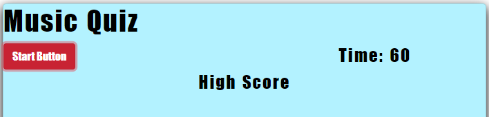

# Music Quiz

## Description
 An app that runs a quiz in the browser featuring dynamically updated HTML and CSS powered by my JavaScript code. It also features a clean and polished user interface that is responsive, ensuring it adapts to multiple screen sizes.

## Table of Contents 

* [Usage](#usage)

* [License](#license)

* [Contributing](#contributing)

* [Questions](#questions)

## Usage

Go to this link [Music Quiz](https://travislovingood.github.io/Homework4/).

## License

This project is licensed under the Oh Yeah License.
  
## Contributing
Travis Lovingood

## Questions

If you have any questions about the repo, open an issue or contact directly at [Music Quiz Github](https://travislovingood.github.io/Homework4/).

